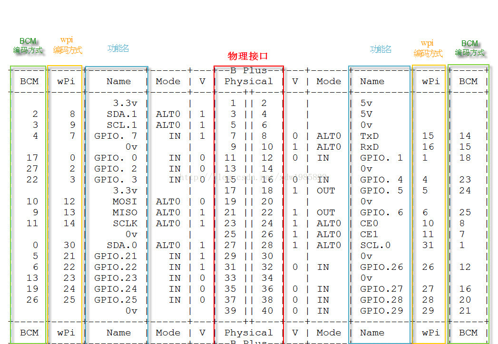

# 树莓派 GPIO 控制

## 常用开源工程简介

树莓派内核中已经编译自带了 gpio 的驱动，我们常通过一些第三方写好的库函数来完成具体的操作，比较常见的操作库函数有：

python GPIO

- 开发语言——python
- 简单介绍——树莓派官方资料中推荐且容易上手。python GPIO 是一个小型的 python 库，可以帮助用户完成 raspberry 相关 IO 口操作，但是 python GPIO 库还没有支持 SPI、I2C 或者 1-wire 等总线接口。
- 官方网站—— [https://code.google.com/p/raspberry-gpio-python/](https://code.google.com/p/raspberry-gpio-python/)

wiringPi

- 开发语言——C 语言
- 简单介绍——wiringPi 适合那些具有 C 语言基础，在接触树莓派之前已经接触过单片机或者嵌入式开发的人群。wiringPi 的 API 函数和 arduino 非常相似，这也使得它广受欢迎。作者给出了大量的说明和示例代码，这些示例代码也包括 UART 设备，I2C 设备和 SPI 设备等。
- 官方网站—— [http://wiringpi.com/](http://wiringpi.com/)

BCM2835 C Library

- 开发语言——C 语言
- 简单介绍——BCM2835 C Library 可以理解为使用C语言实现的相关底层驱动，BCM2835 C Library 的驱动库包括 GPIO、SPI 和 UART 等，可以通过学习 BCM2835 C Library 熟悉 BCM2835 相关的寄存器操作。如果有机会开发树莓派上的 linux 驱动，或自主开发 python 或 PHP 扩展驱动，可以从 BCM2835 C Library 找到不少的“灵感”。
- 官方网站—— [http://www.airspayce.com/mikem/bcm2835/](http://www.airspayce.com/mikem/bcm2835/)

## 树莓派GPIO编号方式

1. 功能物理引脚：
从左到右，从上到下：左边基数，右边偶数：1-40
2. BCM：
编号侧重 CPU 寄存器，根据 BCM2835 的 GPIO 寄存器编号。
3. wpi：
  编号侧重实现逻辑，把扩展 GPIO 端口从 0 开始编号，这种编号方便编程。正如下图 WiringPi 一栏。



## python GPIO

先安装 python-dev，输入以下指令。

```
sudo apt-get install python-dev
```

安装 RPi.GPIO，依次输入以下指令。

- 下载：$ wget http://raspberry-gpio-python.googlecode.com/files/RPi.GPIO-0.5.3a.tar.gz
- 解压缩：$ tar xvzf RPi.GPIO-0.5.3a.tar.gz
- 进入解压之后的目录 ：$ cd RPi.GPIO-0.5.3a
- 启动安装 ：$ sudo python setup.py install

例子：

```
# -*- coding: utf-8 -*-    
 import RPi.GPIO as GPIO    
 import time    
 # BOARD编号方式，基于插座引脚编号    
 GPIO.setmode(GPIO.BOARD)    
 # 输出模式    
 GPIO.setup(11, GPIO.OUT)    
     
 while True:    
     GPIO.output(11, GPIO.HIGH)    
     time.sleep(1)    
     GPIO.output(11, GPIO.LOW)    
     time.sleep(1)   
```

执行：

```
sudo python led.py
```

说明：

- GPIO.setmode(GPIO.BOARD)，采用插座引脚编号方式。
- 由于采用插座引脚编号方式，此处的 11 脚相当于 BCM2835 寄存器编号方式的引脚 11。

## WiringPi GPIO

### 说明

WiringPi 是应用于树莓派平台的 GPIO 控制库函数，WiringPi 遵守 GUN Lv3。wiringPi 使用 C 或者 C++ 开发并且可以被其他语言包转，例如 Python、ruby 或者 PHP 等。 wiringPi 包括一套 gpio 控制命令，使用 gpio 命令可以控制树莓派 GPIO 管脚。用户可以利用 gpio 命令通过 shell 脚本控制或查询 GPIO 管脚。wiringPi 是可以扩展的，可以利用 wiringPi 的内部模块扩展模拟量输入芯片，可以使用 MCP23x17/MCP23x08（I2C 或者 SPI）扩展 GPIO 接口。另外可通过树莓派上的串口和 Atmega（例如 arduino 等）扩展更多的 GPIO 功能。另外，用户可以自己编写扩展模块并把自定义的扩展模块集成到 wiringPi 中。WiringPi 支持模拟量的读取和设置功能，不过在树莓派上并没有模拟量设备。但是使用 WiringPi 中的软件模块却可以轻松地应用 AD 或 DA 芯片。

### wiringPi 安装

- 方案 A——使用 GIT 工具，通过 GIT 获得 wiringPi 的源代码。

```
git clone git://git.drogon.net/wiringPi
cd wiringPi
./build
```

>build 脚本会帮助你编译和安装 wiringPi。

- 方案 B——直接下载，我们可以在[https://git.drogon.net/?p=wiringPi;a=summary](https://git.drogon.net/?p=wiringPi;a=summary) 网站上直接下载最新版本编译使用。

```
tar xfz wiringPi-xx.tar.gz
cd wiringPi-xx
./build
```

### 测试

wiringPi 包括一套 gpio 命令，使用 gpio 命令可以控制树莓派上的各种接口，通过以下指令可以测试wiringPi 是否安装成功。

```
$gpio -v
$gpio readall
```
即可出现上面的 io 图。

### 例子

[cpp] view plaincopy 在 CODE 上查看代码片派生到我的代码片

```
#include <wiringPi.h>    
int main(void)    
{    
  wiringPiSetup() ;    
  pinMode (0, OUTPUT) ;    
  for(;;)     
  {    
    digitalWrite(0, HIGH) ; delay (500) ;    
    digitalWrite(0,  LOW) ; delay (500) ;    
  }    
}   
```
### 编译运行

在树莓派上:

```
gcc -Wall -o test test.c -lwiringPi 
sudo ./test
```

在虚拟机中：

```
am-linux-gcc -Wall -o test test.c -lwiringPi 
sudo ./test
```

### 注意事项：

- IO 的编号方式略有不同，采用 wiring 编码方式。
- -lwiringPi 表示动态加载 wiringPi 共享库。

## BCM2835 C Library

- 下载：$ wget http://www.airspayce.com/mikem/bcm2835/bcm2835-1.35.tar.gz
- 解压缩：$tar xvzf bcm2835-1.35.tar.gz
- 进入压缩之后的目录：$cd bcm2835-1.35
- 配置：$./configure
- 从源代码生成安装包：$make
- 执行检查：$sudo make check
- 安装 bcm2835库：$sudo make install
- 例子[cpp] view plaincopy 在 CODE 上查看代码片派生到我的代码片

```
#include <bcm2835.h>    
    
// P1插座第11脚    
#define PIN RPI_GPIO_P1_11    
    
int main(int argc, char **argv)    
{    
  if (!bcm2835_init())    
  return 1;    
    
  // 输出方式    
  bcm2835_gpio_fsel(PIN, BCM2835_GPIO_FSEL_OUTP);    
    
  while (1)    
  {    
    bcm2835_gpio_write(PIN, HIGH);    
    bcm2835_delay(100);    
        
    bcm2835_gpio_write(PIN, LOW);    
    bcm2835_delay(100);    
  }    
  bcm2835_close();    
  return 0;    
}   
```

> 注意事项：
>
- IO 的编号方式略有不同，采用 wiring 编码方式。
- -lwiringPi 表示动态加载 wiringPi 共享库。