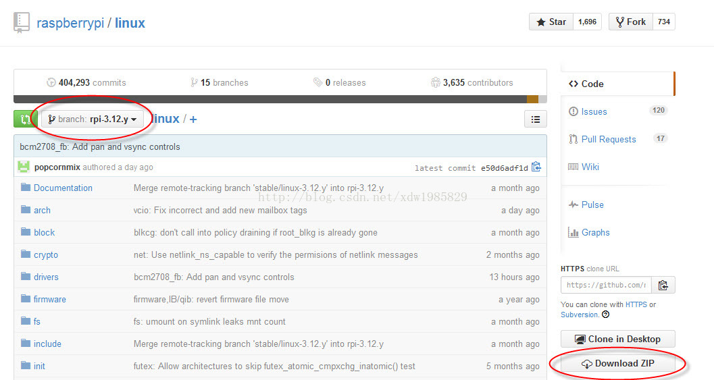
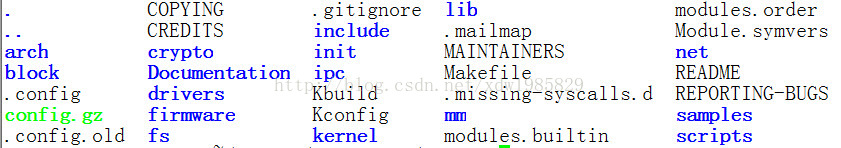
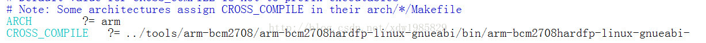
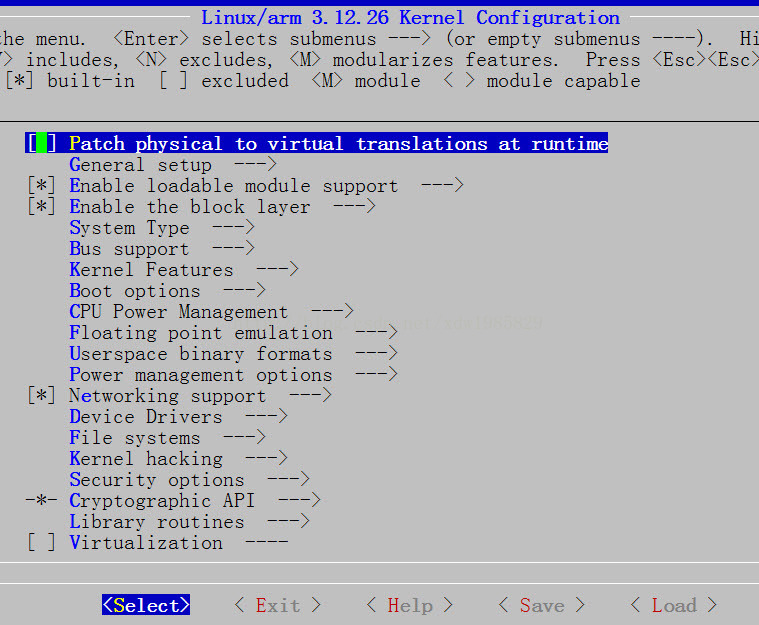

# 树莓派内核编译与固件升级

前面我们已经使用官方给的镜像搭建好了树莓派的开发环境，可以说已经可以上手应用了，但是如果官方提供的内核有些功能不能满足我们的需要或者需要对内核进行部分裁剪，那么就需要对树莓派的内核进行裁剪，这里我们教一下大家如何更新树莓派内核。

## 获取升级所需源码

### 下载地址

官方网址：[https://github.com/raspberrypi](https://github.com/raspberrypi)

上面列出了树莓派所有的开源软件

- firmware：树莓派的交叉编译好的二进制内核、模块、库、bootloader
- linux：内核源码
- tools：编译内核和其他源码所需的工具——交叉编译器等

我们只需要以上三个文件即可，下面的工程可以了解一下

- documentation：树莓派离线帮助文档，教你如何使用、部署树莓派（树莓派官方使用教程）
- userland：arm 端用户空间的一些应用库的源码——vc 视频硬浮点、EGL、mmal、openVG 等
- hats：Hardware Attached on Top，树莓派 B+ 型板子的扩展板资料
- maynard：一个 gtk 写成的桌面环境
- scratch：一个简易、可视化编程环境
- noobs：一个树莓派镜像管理工具，他可以让你在一个树莓派上部署多个镜像
- weston：一个应用程序
- target_fs：树莓派最小文件系统，使用 busybox 制作
- quake3：雷神之锤 3 有线开发源码 firmwareb

### 下载方法

网页直接下载



到所需要下载的工程，左上角选版本，右方有一个 download ZIP 按钮可直接下载（笔者下载完成后，在 linux 中解压提示出错，Windows 又非常慢切内核建议不要在 Windows 环境解压，所以笔者不建议使用这种办法）。

使用 git 下载

```
$ mkdir raspeberrypi_src
$ cd raspberrypi_src
$ git clone git://github.com/raspberrypi/firmware.git
$ git clone git://github.com/raspberrypi/linux.git
$ git clone git://github.com/raspberrypi/tools.git
```
会得到三个文件夹：**firmware linux tools**

## 编译、提取内核及其模块

### 获得内核配置文件

在运行的树莓派中运行

```
$ls /proc/
```
可看到一个叫 config.gz 的文件，他是当前的树莓派配置选项记录文件，我们将他拷出，放入我们的内核源码目录树下。

```
$cp /proc/config /home/pi
```

我们这里使用前面交过的 samba 拷出并拷入内核源码目录下，不熟悉的人可参考前面文章。

在 linux 内核源码下执行

```
$zcat config.gz > .config
```



### 配置、编译内核

修改内核源码 makefile ARCH 类型和编译器路径`$vi Makefile +195`，找到以上类似代码，改为如图所示。



查看、修改配置选项`$make menuconfig`，可出现以下界面。



>如果不做修改，直接选中 exit 即可（注意使用键盘操作）。

编译内核镜像`$make`在`arch/arm/boot`目录下可以看到一个叫`zImage`的文件，就是我们新的内核，但是树莓派需要另外一种格式的镜像，需要进行处理一下，执行以下命令

```
$cd tools/mkimage

$./imagetool-uncompressed.py ../../linux/arch/arm/boot/zImage
```

即可在当前文件夹下看到一个叫`kernel.img`的文件，就是我们需要的新内核了。

提取 modules 上一步其实不但编译出来了内核的源码，一些模块文件也编译出来了，这里我们提取一下，

```
$cd raspberrypi_src
$mkdir modules
$cd linux
$ make modules_install INSTALL_MOD_PATH=../modules
```

即可在 modules 得到我们需要的模块文件。

## 升级 RPi 的 kernel、Firmware、lib

将SD卡拔下插在电脑上（可使用读卡器）

1. 升级内核，将新编好的内核拷入 SD 卡，改名为`：kernel_new.img`。打开 boot 目录下
找到`config.txt`文件，加入`：kernel=kernel_new.img`这一行。

2. 升级 boot，将`firmware/boot/`目录下文件拷入 SD 卡 boot 目录`：fbootcode.bin fixup.dat fixup_cd.dat start.elf`

3. 更新 vc 库及内核 modules，将编译出来的`modules/lib/modules`拷入树莓派文件系统`/lib`下


