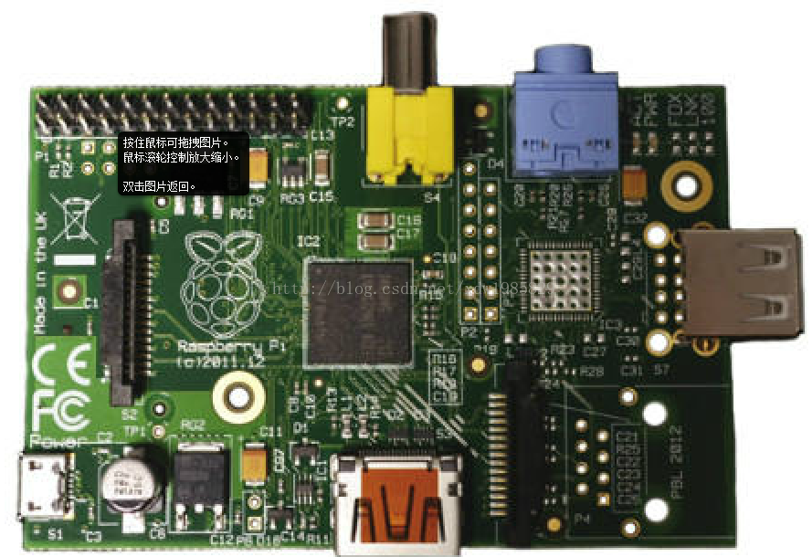
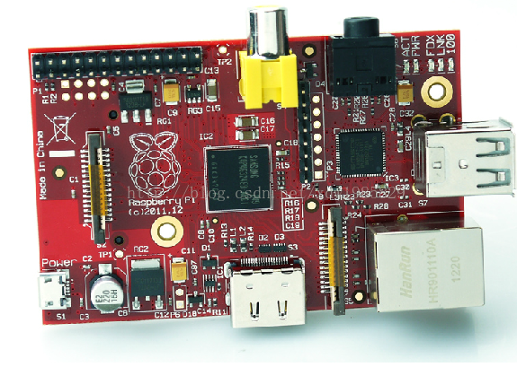
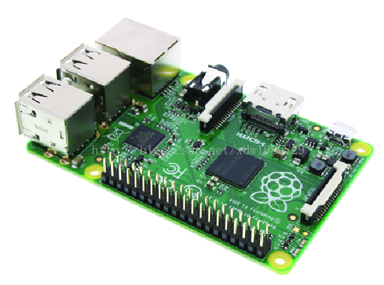
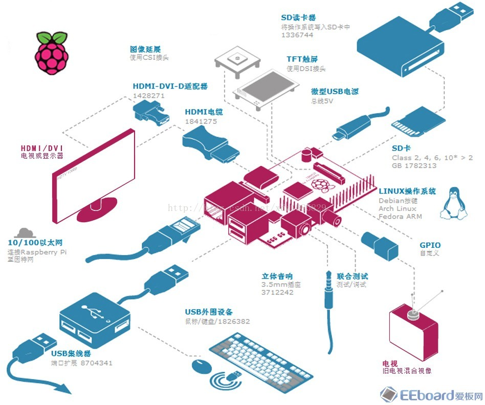

# 树莓派介绍

## 树莓派是什么？

Raspberry Pi(中文名为“树莓派”,简写为 RPi，或者 RasPi/RPi)是为学生计算机编程教育而设计，只有信用卡大小的卡片式电脑，其系统基于 Linux。

树莓派由注册于英国的慈善组织“Raspberry Pi 基金会”开发，Eben·Upton /埃·厄普顿为项目带头人。2012 年 3 月，英国剑桥大学埃本·阿普顿（Eben Epton）正式发售世界上最小的台式机，又称卡片式电脑，外形只有信用卡大小，却具有电脑的所有基本功能，这就是Raspberry Pi 电脑板，中文译名"树莓派"！这一基金会以提升学校计算机科学及相关学科的教育，让计算机变得有趣为宗旨。基金会期望这 一款电脑无论是在发展中国家还是在发达国家，会有更多的其它应用不断被开发出来，并应用到更多领域。

一句话：树莓派是一个卡片大小的开发板，上面可以运行 Linux 系统，我们可以用它开发我想要的设备。

## 树莓派的种类

- A 型：1 个 USB、无有线网络接口、功率 2.5W,500mA、256MB RAM（基本已经见不到了）。
- B 型：2 个 USB、支持有线网络、功率 3.5W，700mA、512MB RAM、26个GPIO（市售还有很多）。
- B+ 型：4 个 USB 口、支持有线网络，功耗 1W，512M RAM 40个GPIO（2014 新出的，推荐使用）。

>购买请在淘宝上搜一下，非常多：200到--300元之间（裸板，不含 SD 卡、电源）

A 型

B 型

B+ 型

## 树莓派参数

### B 型

|简介|具体描述|
|:----|:-----|
|处理器|	BroadcomBCM2835（CPU，GPU，DSP和SDRAM，USB）|
|CPU|ARM1176JZF-S 核心（ARM11 系列）700MHz|
GPU Broadcom VideoCrore IV，OpenGL ES 2.0,1080p 30 h.264/MPEG-4 AVC 高清解码器|
|内存 |512MByte|
|USB 2.0 |2（支持 USB hub 扩展）|
|影像输出 |Composite RCA（PAL & NTSC），HDMI（rev 1.3 & 1.4），raw LCD Panels via DSI 14 HDMI resolution from 640x350 to 1920x1200 plus various PAL andNTSC standards|
|音源输出| 3.5mm 插孔，HDMI|
|板载存储| SD/MMC/SDIO 卡插槽|
|网络接口 |10/100 以太网接口|
|外设 |8xGPIO、UART、I2C、带两个选择的 SPI 总线，+3.3V，+5V，ground（负极）|
|额定功率| 700mA（3.5W）|
|电源输入 |5V / 通过 MicroUSB 或 GPIO 头|
|总体尺寸 |85.60 x 53.98 mm（3.370 x 2.125 in）|
|操作系统 |Debian GNU/linux，Fedora，Arch Linux ARM，RISC OS, XBMC|

### B+ 改进

- 更多的 GPIO：B+ 将通用输入输出引脚增加到了 40 个，而 Model B 则只有 26 个；
- 更多的 USB：B+ 提供了 4 个 USB 端口，对热插拔有着更好的兼容性(Model B 只有 2 个)；
-支持 microSD：旧款的 SD 卡插槽，已经被换成了更漂亮的推入式microSD 卡槽；
- 更低的功耗：将线性式稳压器换成了开关式，功耗降低了 0.5W 到 1W；
- 更好的音频：音频电路部分采用了专用的低噪供电；
- 简洁的外形：USB 接口被推到了主板的一边，复合视频移到了 3.5mm 音频口的位置，此外还增加了 4 个独立的安装孔。

## 树莓派分布图

B 型，B+ 类似，请自行对比参考

