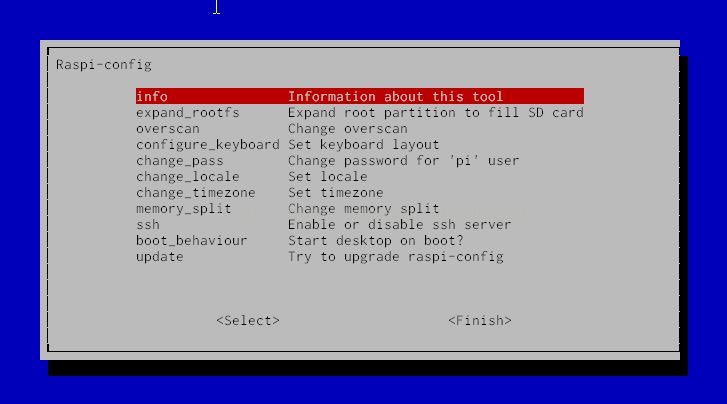
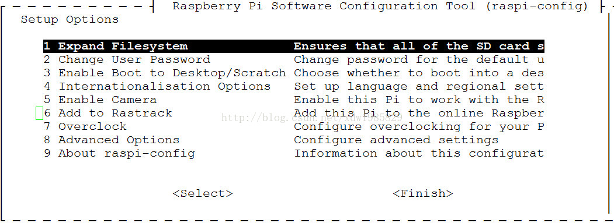

# 树莓派配置

经过前面两步我们的树莓派已经正常的工作起来了，但是在真正用它开发之前还需要进行一些列的配置以及软件的安装，这样开发起来才会得心应手。

## 配置选项

树莓派第一次使用的时候需要进行一个简单的配置，在命令行模式下运行以下命令：

```
    $sudo raspi-config
```

新旧版本的配置界面不太一样，下面列举两种比较常见的：

**旧版本**



- **expand_rootfs** – 将根分区扩展到整张 SD 卡（树莓派默认不使用 SD 卡的全部空间，有一部分保留，建议选中）
- **overscan** – 可以扩充或缩小屏幕（旧版不能自适应屏幕，新版没有这个选项，貌似可以自适应，没仔细研究）
- **configure_keyboard** - 键盘配置界面
- **change_pass** – 默认的用户名是 pi，密码是 raspberry，用ssh 远程连接或串口登录时要用到这个用户名和密码，这里可以更改密码。
- **change_locale** – 更改语言设置。在 Locales to be generated: 中，选择 en_US.UTF-8 和 zh_CN.UTF-8。在 Default locale for the -system environment:中，选择 en_US.UTF-8（等启动完机器，装完中文字体，再改回 zh_CN.UTF-8，否则第一次启动会出现方块）。
- **change_timezone** – 因为树莓派没有内部时钟，是通过网络获取的时间，选择 Asia – Shanghai。
- **memory_split** – 配置给桌面显示的显存。
- **ssh** – 是否激活 sshd 服务。
- **boot_behaviour** – 设置启动时启动图形界面，正常肯定是 Yes。

**新版本（比较新的镜像大部分是这个界面，做了不少改变）**



1.**Expand Filesystem** 扩展文件系统（同旧版）。

2.**Change User Password** 改变默认 pi 用户的密码，按回车后输入 pi 用户的新密码。

3.**Enable Boot to Desktop/Scratch** 启动时进入的环境选择。</br>
  Console Text console, requiring login(default)</br>
   启动时进入字符控制台，需要进行登录（默认项）。</br>
  Desktop log in as user 'pi' at the graphical desktop</br>
   启动时进入 LXDE 图形界面的桌面。</br>
  Scratch Start the Scratch programming environment upon boot</br>
   启动时进入 Scratch 编程环境。

4.**Internationalisation Options** 国际化选项，可以更改默认语言</br>

**Change Locale**：语言和区域设置，建议不要改，默认英文就好。想改中文，最好选安装了中文字体再进行这步，安装中文字体的方法：</br>
sudo apt-get update</br>
sudo apt-get install ttf-wqy-zenhei ttf-wqy-microhei</br>
移动到屏幕底部，用空格键选中 zh-CN GB2312,zh-CN GB18030,zh-CN UTF-8,然后按回车，然后默认语言选中 zh-cn 然后回车。

**Change Timezone**：设置时区，如果不进行设置，PI 的时间就显示不正常。选择 Asia（亚洲）再选择 Chongqing（重庆）即可。

**Change Keyboard Layout**：改变键盘布局

5.**Enable Camera**

启动 PI 的摄像头模块，如果想启用，选择 Enable，禁用选择 Disable就行了。

6.**Add to Rastrack**

把你的 PI 的地理位置添加到一个全世界开启此选项的地图，建议还是不要开了，免得被跟踪。

7.**Overclock**

|SN|描述|
|:----|:-----|
|None |不超频，运行在 700Mhz，核心频率 250Mhz，内存频率 400Mhz，不增加电压|
 |Modest |适度超频，运行在 800Mhz，核心频率 250Mhz，内存频率 400Mhz，不增加电压|
|Medium| 中度超频，运行在 900Mhz，核心频率 250Mhz，内存频率 450Mhz，增加电压 2|
|High| 高度超频，运行在 950Mhz，核心频率 250Mhz，内存频率 450Mhz，增加电压 6|
|Turbo| 终极超频，运行在 1000Mhz，核心频率 500Mhz，内存频率 600Mhz，增加电压 6|

8.**Advanced Options**  高级设置

|SN |标准 | 描述|
|:---|:---|:----|
|A1| Overscan |  是否让屏幕内容全屏显示|
|A2 |Hostname |  在网上邻居或者路由器能看到的主机名称|
|A3 |Memory Split| 内存分配，选择给 GPU 多少内存|
|A4 |SSH |是否运行 SSH 登录，建议开户此选项，以后操作 PI 方便，有网络就行，不用开屏幕了|
|A5 |SPI |是否默认启动 SPI 内核驱动，新手就不用管了|
|A6| Audio |选择声音默认输出到模拟口还是 HDMI 口| 
|A7 |Update |把 raspi-config 这个工具自动升级到最新版本|


> A6 </br>
>  0 Auto 自动选择</br>
   1 Force 3.5mm ('headphone') jack强制输出到3.5mm模拟口</br>
   2 Force HDMI 强制输出到HDMI

9.**About raspi-config** 

关于 raspi-config 的信息。
