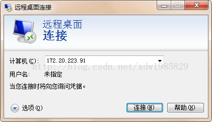
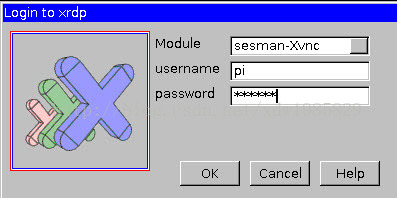
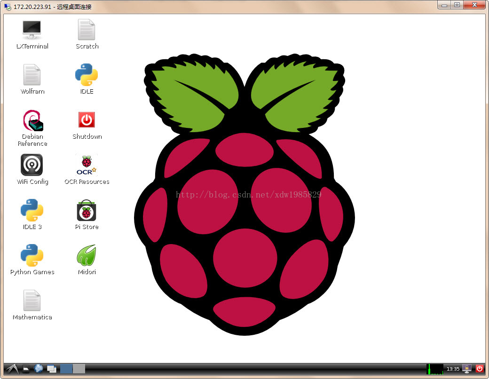
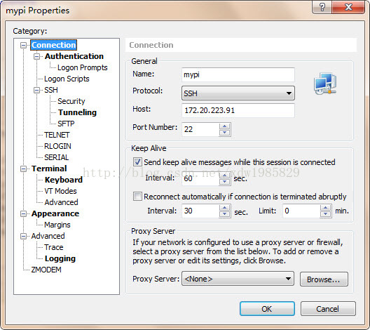
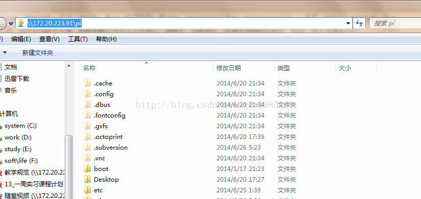

# 树莓派常用软件及服务

## 更新 vim

树莓派自带的 vim 不是很好用，比如默认不支持小键盘及方向键等，我们可以更新一下

```
sudo apt-get install vim
```

## 使用远程桌面

通过 Windows 自带的远程桌面软件，可以远程访问树莓派桌面应用

```
sudo apt-get install xrdp
```






## ssh

ssh 服务默认已经安装完毕，
只需要安装一个 ssh 客户端即可，笔者推荐 xshell4.0(Xmanage4.0 的一个组件)。

host 填入:开发板 ip 即可。

用户名、密码同串口登陆一致（默认：pi、raspberry）



## 使用 samba

通过 samba 服务，可以自由、访问修改树莓派家目录下的文件、代码。

**首先安装 samba**
`sudo apt-get install samba samba-common-bin`

**然后修改配置文件**
`sudo vi /etc/samba/smb.conf`

**下面的配置是让用户可以访问自己的 home 目录**。

- 开启用户认证，找到`##### Authentication #####`，将`#  security = user`的`#`号去掉。
- 配置用户可以读写自己的 home 目录，在`[homes]`节中，把 `read only = yes` 改为`read only = no` 。
- 找到`browseable=no`改为`yes`，否则等会访问时此文件夹会隐藏。

**重启 samba 服务** `sudo /etc/init.d/samba restart`

**把系统默认用户 pi 添加到 samba**`sudo smbpasswd -a pi`
会提示你输入密码：建议跟串口登陆的密码一致，防止密码太多弄混了。

**windows 访问**
任意打开一个文件浏览器，输入 ip 地址:`\\172.20.223.91\pi`
现在就可以从其它机器上访问 pi 这个用户的 home 目录了。



## 挂载 U 盘

当需要大容量外接存储设备时，可使用U盘挂载
通常我们在 /mnt 或 /media 目录下新建一个目录作为挂载点。比如：

```
sudo mkdir /mnt/udisk
```

### 手动挂挂载

挂载命令

```
sudo mount -o uid=pi,gid=pi /dev/sda1 /mnt/udisk
```

用完之后卸载

```
sudo umount /mnt/1GB_USB_flash
```

>注意：
sda1 是取决于你的实际情况，a 表示第一个硬盘，1 表示第一个分区。
FAT 格式 U 盘 mount 本身就能支持，但如果你的 U 盘或移动硬盘使用的是 exFAT 格式，mount 会说不支持。没关系，安装 exfat-fuse 软件之后 mount 就支持了。`sudo apt-get install exfat-fuse`

### 开机挂载

如果想开机自动挂载，而不是每次手工执行，可以编辑 /etc/fstab 文件。在末尾添加一行：

```
/dev/sda1 /mnt/udisk vfat rw,defaults 0 0
```

每次开机就会自动挂载。

### 热插挂载

需要希望想电脑一样，插上自动识别挂载在某一目录下，拔下自动 umount，请按一下操作
`sudo vi /etc/udev/rules.d/10-usbstorage.rules`(此文件默认没有，需要新建)
赋值以下内容即可，会自动在 /mnt/udisk 目录下挂载 U 盘。

```
KERNEL!="sd*", GOTO="media_by_label_auto_mount_end"  
SUBSYSTEM!="block",GOTO="media_by_label_auto_mount_end"  
IMPORT{program}="/sbin/blkid -o udev -p %N"  
ENV{ID_FS_TYPE}=="", GOTO="media_by_label_auto_mount_end"  
ENV{ID_FS_LABEL}!="", ENV{dir_name}="%E{ID_FS_LABEL}"  
ENV{ID_FS_LABEL}=="", ENV{dir_name}="Untitled-%k"  
ACTION=="add", ENV{mount_options}="relatime,sync"  
ACTION=="add", ENV{ID_FS_TYPE}=="vfat", ENV{mount_options}="iocharset=utf8,umaskk  
=000"  
ACTION=="add", ENV{ID_FS_TYPE}=="ntfs", ENV{mount_options}="iocharset=utf8,umaskk  
=000"  
ACTION=="add", RUN+="/bin/mkdir -p /mnt/udisk/", RUN+="/bin/mount -o $env{mount__  
options} /dev/%k /mnt/udisk/"  
  
ACTION=="remove", ENV{dir_name}!="", RUN+="/bin/umount -l /mnt/udisk/}", RUN+="//  
bin/rmdir /mnt/udisk/"  
LABEL="media_by_label_auto_mount_end" 
```

