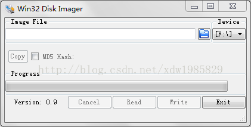
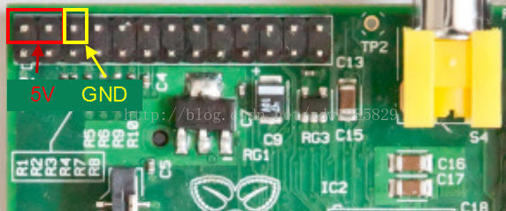
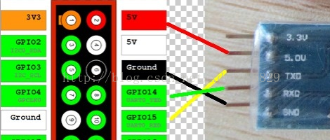
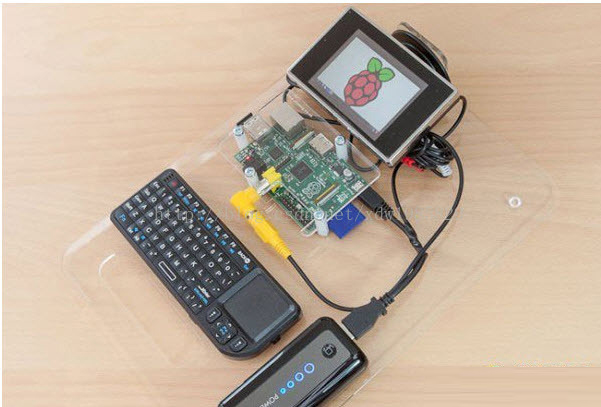
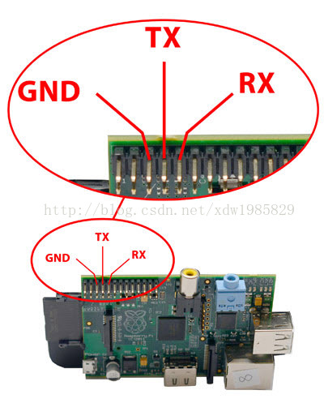

## 树莓派启动方式及支持的系统

树莓派开发板没有配置板载 FLASH，因为它支持 SD 卡启动，所有我们需要下载相应镜像，并将其烧写在 SD 上，启动系统即可
(这个镜像里包含了我们通常所说的 bootloader、kernel、文件系统)
树莓派由于其开源特性，支持非常多的系统类型（指的文件系统）：

Raspbian、Arch Linux ARM、Debian Squeeze、Firefox OS、Gentoo Linux
Google Chrome OS、Raspberry Pi Fedora Remix、Slackware ARM
QtonPi、Slackware ARM、WebOS、RISC OS、FreeBSD
NetBSD、Android 4.0(Ice Cream Sandwich)

详细介绍请看维基百科：http://zh.wikipedia.org/wiki/%E6%A0%91%E8%8E%93%E6%B4%BE

## 树莓派镜像下载地址

http://www.raspberrypi.org/  官网（速度较慢）

http://pan.baidu.com/share/home?uk=671504480#category/type=0  
树莓派论坛提供的下载地址 （百度网盘速度较快）

建议下载：wheezy-raspbian 
笔者更新时，最新版本为：2014.6.20(B+ 版建议使用此版本，笔者将旧版烧入 B+ 版中貌似网卡及 USB 驱动不能识别)

## 镜像烧写

准备工作

1. 一张 2G 以上的 SD 卡及读卡器，最好是高速卡，推荐 Class4 以上的卡，卡的速度直接影响树莓派的运行速度
   笔者建议最好 4G 以上，否则后续开发会使用经常不够用

2. WinXP 和 Win7 下安装镜像的工具：Win32DiskImager.zip
   同样在上一步的网址下载

3. 上一步下载好的镜像

安装

1. 解压下载的系统压缩文件，得到 img 镜像文件

2. 将 SD 使用卡托或者读卡器后，连上电脑

3. 解压并运行 win32diskimager 工具



4. 在软件中选择 img 文件，“Device”下选择 SD 的盘符，然后选择“Write”然后就开始安装系统了，根据你的 SD 速度，安装过程有快有慢。

5. 安装结束后会弹出完成对话框，说明安装就完成了，如果不成功，请关闭防火墙一类的软件，重新插入 SD 进行安装，请注意安装完，win 系统下看到 SD 只有 74MB 了，这是正常现象，因为 linux 下的分区 win 下是看不到的！

## 开发板供电

树莓派开发板有两种供电方式：

- 使用 micro usb 供电：所有 android 手机的充电线都可以给他供电
- 外接电源直接供电：B 型（B+型）GPIO 左上角的 2、4 管角为电源正极，6 管角为地





## 树莓派访问方式

### 初始启动

**外接 HDMI 或者 AV 显示器，USB 鼠标、键盘** 

把树莓派当作一个小电脑，可以用外接键盘、鼠标操作树莓派，树莓派启动界面会显示在 HDMI 或者 AV 显示器上。
笔者不太建议这种启动方式——抱着个显示、鼠标键盘太不方便了，而且带 HDMI 的显示器不好找。（虽然可以用 HDMI 转 VGA 接在电脑显示器上代替）




**使用 USB 转 ttl 串口线通过串口访问树莓派**

树莓派默认支持串口启动，我们只需要一根：usb 转 ttl 线（淘宝上很多，10 几块钱一根）连接树莓派与电脑，即可通过串口控制调试树莓派（电脑上使用超级终端或者其它串口调试工具，笔者建议使 Xshell4.0）

树莓派串口连接口请见下图中所示



在终端中会显示类似启动信息，如下：

中间会提示输出用户名和密码：

默认用户名：pi

默认密码：raspberry

```
octopi login: pi
Password: 
Last login: Fri Jun 20 09:32:38 UTC 2014 on ttyAMA0
Linux octopi 3.12.22+ #691 PREEMPT Wed Jun 18 18:29:58 BST 2014 armv6l

The programs included with the Debian GNU/Linux system are free software;
the exact distribution terms for each program are described in the
individual files in /usr/share/doc/*/copyright.

Debian GNU/Linux comes with ABSOLUTELY NO WARRANTY, to the extent
permitted by applicable law.

NOTICE: the software on this Raspberry Pi has not been fully configured. Please run 'sudo raspi-config'
pi@octopi:~$ 
```

### 其它访问方式

- SSH：由于树莓派只有一个串口，当我们开发中需要占用这个串口或者我们希望进行远程开发（通过一个根网线或无线连接到树莓派）
可以借助 Linux 系统特有的一种服务 SSH 来完成（请见后面的文章）。
- VNC：VNC 是 linux 下面常用的远程桌面，用它可以在 Windows 或者 unix 主机上方便的通过网络操作远程主机而不需要一个额外的显示器，非常实用（请见后面的文章）。
- 远程桌面：远程桌面是 Windows 自带的一个远程桌面登陆系统，很好用（请见后面的文章）。

以上三种方式都是通过网络对树莓派进行控制，可以说只要知道了树莓派的 ip 地址，一切控制 so easy。

